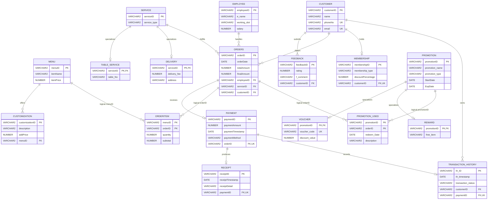

<div align="center">

# 🍽️ POS Database System

**An Oracle data layer for restaurant ordering, payment, promotion, membership, and receipt workflows.**


</div>

## 🎯 Product Promise

Keep a restaurant POS workflow consistent from menu selection to payment history. The schema models the operational records behind counter and kiosk ordering while PL/SQL modules provide reusable updates, lookups, calculations, and transaction utilities.

## 🔎 Problem

A POS database must connect customers, employees, service modes, orders, payments, promotions, and receipts without losing traceability. It also needs domain rules for ratings, membership tiers, payment methods, transaction states, and menu customization pricing.

## ✨ Capabilities

- Models dine-in and delivery through a shared service record with specialized detail tables.
- Connects orders to customers, employees, payment, receipts, and transaction history.
- Supports menu prices, item customization charges, discounts, vouchers, and rewards.
- Enforces primary keys, declared foreign keys, uniqueness rules, value checks, and required fields.
- Provides query examples plus eight procedures and eight functions across four functional SQL modules.
- Includes representative seed records for inspecting queries and PL/SQL behavior.

## 🗺️ Schema Architecture

The consolidated script defines **18 tables**. Solid relationships below are declared foreign keys. Relationships labelled `logical` use matching identifiers in the tables but are not declared as foreign-key constraints in the script.



## 🧩 PL/SQL Modules

| Module | Queries | Procedures | Functions |
|---|---|---|---|
| `Promotion_Transaction.sql` | Active vouchers; promotion usage by customer | Record promotion usage; delete a transaction | Count promotions; find a customer's latest transaction date |
| `Employee_Menu.sql` | Employee order workload; delivery payment view | Update employee details; update menu items | Look up item price; calculate base plus customization price |
| `Payment_Receipt_Service.sql` | Employee and customer service views | Update payments; update receipts | Sum delivery fees; count successful transactions |
| `Customer_Membership_Feedback.sql` | Ratings, memberships, and customer payment history | Update customers; update memberships | Generate receipt text; calculate average rating |

## Transaction and Data-Integrity Flow

1. `Menu` and `Customization` define base prices and optional charges.
2. `Orders` connects a customer, employee, and service mode. `Table_Service` and
   `Delivery` specialize the shared service identifier for dine-in or delivery.
3. `OrderItem` records menu quantities and subtotals for an order. Its composite
   key prevents the same menu identifier from appearing twice in one order.
4. `Payment` is unique per order, `Receipt` is unique per payment, and
   `Transaction_History` records the payment result for a customer.
5. `Promotion_Used` links an order with a voucher or reward and records when it
   was redeemed. The promotion module can insert usage, count promotion types,
   and retrieve a customer's latest transaction date.

### SQL and PL/SQL decisions

- Primary, unique, check, and foreign-key constraints reject invalid states at
  the database boundary rather than relying only on an application interface.
- Shared parent tables with specialized child tables reduce repeated service and
  promotion fields while preserving type-specific data.
- Procedures perform named updates or transaction operations; functions return
  reusable values for queries and reports.
- `%TYPE` parameters follow the referenced column type, reducing mismatch risk
  when a column definition changes.
- The scripts use explicit `COMMIT` statements for demonstrations. In an
  application, transaction ownership and rollback policy should normally remain
  with the calling service.
- `OrderItem` and `Promotion_Used` have logical relationships that are not
  declared as foreign keys in `G036.sql`; adding those constraints is a clear
  production improvement.

## Technical Checkpoints

| Topic | Source checkpoint |
|---|---|
| Complete schema, constraints, and seed data | `sql/G036.sql` |
| Promotion joins and active-voucher query | `sql/Promotion_Transaction.sql` queries 1-2 |
| Promotion insertion and transaction deletion | `Insert_Promotion_Usage`, `Delete_Transaction` |
| Optional filter and aggregate logic | `Count_Promotions` |
| Customer transaction lookup | `get_latest_transaction_date` |
| Other team database modules | `sql/Employee_Menu.sql`, `sql/Payment_Receipt_Service.sql`, `sql/Customer_Membership_Feedback.sql` |

## Project Context

This is a Database Technology group project. The README explains the complete
restaurant POS data layer so its relationships and workflows are understandable.
Ian Hong's individual SQL contribution is `Promotion_Transaction.sql`: two
queries, two procedures, and two functions covering promotions and transaction
history. The remaining category modules are included as team work and are not
presented as his individual implementation.

## 🛠️ Technology

| Layer | Technology |
|---|---|
| Database | Oracle Database |
| Definition and queries | Oracle SQL |
| Business logic | PL/SQL procedures and functions |
| Data integrity | PK, FK, UNIQUE, CHECK, NOT NULL, and composite-key constraints |
| Supporting references | CSV, XLSX, and DOCX |

## 🚀 Setup and Run

Use a disposable Oracle schema: the consolidated script begins with `DROP TABLE ... CASCADE CONSTRAINTS` and then creates and seeds the database.

1. Connect to the target schema with SQL*Plus or Oracle SQL Developer.
2. Run the consolidated schema and seed script:

   ```sql
   @sql/G036.sql
   ```

3. Run a functional module after the schema is available:

   ```sql
   @sql/Promotion_Transaction.sql
   @sql/Employee_Menu.sql
   @sql/Payment_Receipt_Service.sql
   @sql/Customer_Membership_Feedback.sql
   ```

The functional modules contain demonstration DML and explicit `COMMIT` statements. Review them before running against retained data.

## ✅ Validation and Boundaries

- The architecture and capability inventory were verified against the committed SQL definitions.
- The schema script contains 18 `CREATE TABLE` statements, eight declared procedures, and eight declared functions.
- Oracle execution is **not claimed** here; database availability, privileges, and client configuration are environment-specific.
- `OrderItem` and `Promotion_Used` use composite primary keys but do not declare foreign-key constraints in the consolidated script.
- This repository provides the database layer only; it does not include a POS user interface or application server.

## 📄 License

Released under the [MIT License](LICENSE).
